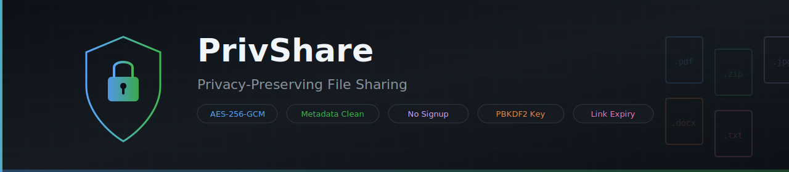

<p align="center">
  
</p>

# PrivShare Privacy Preserving File Sharing

A  password-protected file sharing web app. Upload a file, set a password, get a share link. The system strips metadata, encrypts the file, and the receiver needs both the link and the password to decrypt.

## Core Flow

```
Upload file + password → Clean metadata → Encrypt (AES-256-GCM) → Generate share link → Receiver enters password to decrypt
```

## Features

- No sign-up, no user accounts
- Metadata cleaning before encryption (ExifTool, Pillow, pypdf, Office-cleaner, ZIP-cleaner)
- AES-256-GCM authenticated encryption
- PBKDF2-HMAC-SHA256 key derivation (390,000 iterations)
- Password never stored or placed in URLs
- Configurable link expiry
- Download count tracking
- Docker-ready with ExifTool pre-installed

## Stack

| Layer | Technology |
|---|---|
| Backend | Python Flask + Gunicorn |
| Encryption | AES-256-GCM + PBKDF2-HMAC-SHA256 |
| Metadata Cleaning | ExifTool, Pillow, pypdf |
| Database | SQLite |
| Frontend | HTML, CSS, JavaScript |
| Deployment | Docker, Docker Compose, Render, Railway |

## Supported File Types

**All file types are allowed.** Metadata cleaning applies where possible:

| File Type | Extensions | Metadata Cleaner |
|---|---|---|
| Images | `.jpg`, `.jpeg`, `.png`, `.gif`, `.webp` | ExifTool → Pillow fallback |
| PDF | `.pdf` | ExifTool → pypdf fallback |
| Office | `.docx`, `.xlsx`, `.pptx` | docProps XML stripper |
| Archives | `.zip` | Extract → clean contents → repack |
| Plain text | `.txt`, `.csv` | Native (no metadata to strip) |
| Other | any extension | Copied as-is, then encrypted |

## Requirements

- Python 3.10+
- ExifTool (required)

## Install ExifTool

**Linux:**
```bash
sudo apt update && sudo apt install -y libimage-exiftool-perl
```

**macOS:**
```bash
brew install exiftool
```

**Windows:**
Download from https://exiftool.org/ and add to PATH.

## Quick Start

```bash
# 1. Create and activate virtual environment
python3 -m venv .venv
source .venv/bin/activate

# 2. Install dependencies
pip install -r requirements.txt

# 3. Copy environment config
cp .env.example .env

# 4. Initialize database
python cli.py init-db

# 5. Run the server
python app.py
```

Open: `http://127.0.0.1:5000`

## Production Run

```bash
gunicorn -w 2 -b 0.0.0.0:5000 app:app
```

## Docker

```bash
docker build -t privshare .
docker run -p 8000:8000 --env-file .env privshare
```

## CLI Commands

```bash
python cli.py init-db           # Initialize database
python cli.py cleanup-expired   # Delete expired files
python cli.py list-files        # List file records
python cli.py smoke-test        # Run encryption smoke test
```

## Testing

```bash
pytest tests/ -v
```

## Routes

| Route | Method | Purpose |
|---|---|---|
| `/` | GET | Upload form |
| `/upload` | POST | Clean, encrypt, store, generate link |
| `/file/<token>` | GET | Password form for receiver |
| `/file/<token>` | POST | Decrypt and download |
| `/health` | GET | Health check |

## Deploy to Render (Free)

1. Push this repo to GitHub
2. Go to https://dashboard.render.com/blueprint/new?repo=YOUR_REPO_URL
3. Connect and deploy — `render.yaml` builds the Docker image automatically
